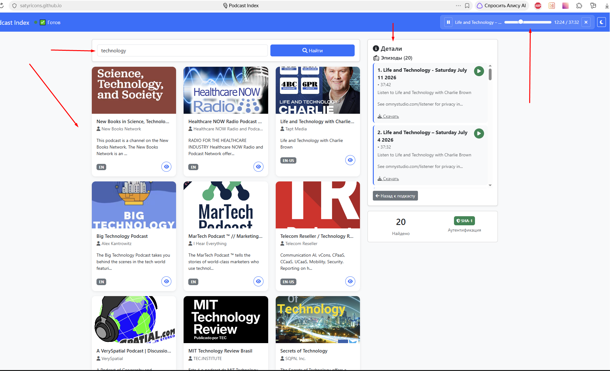

Деплой: https://satyricons.github.io/podcast-player/

Выбрал такой способ: разместить бэкенд на Render, а фронтенд на GitHub Pages. Это проще, чем настраивать Netlify

*
GitHub: podcast-player (фронтенд -> gh-pages)

 📁 docs/

│   ├── index.html

│   ├── css/---style.css

│   └── js/

│       └── app.js (с изменёнными URL)

└── 📄 README.md

└─server.js (для возможности локально запускать node server.js)

*
GitHub: podcast-player-backend (бэкенд)

├── server.js

├── package.json

└── .gitignore

*
Render: podcast-player-api (Web Service)

├── запускает server.js

├── использует переменные окружения

└── доступен по URL: https://podcast-player-backend.onrender.com/

////////////////

Работа с Render:

render.com -> Sign Up (можно через GitHub) -> create Web Service 
New + → Web Service

Подключаю репозиторий podcast-player-backend

Такие настройки:

Name    podcast-player-api
Environment    Node
Build Command    npm install
Start Command    node server.js

Переменные окружения
В разделе Environment Variables:

Ключ    Значение
PODCAST_INDEX_APIKEY    вашреальный_ключ
PODCAST_INDEX_APISECRET    вашреальный_секрет

Жмём Create Web Service
Через 1-2 минуты URL:
что то типа  https://podcast-player-backend.onrender.com/
Этот URL понадобится для фронтенда. 

/////////////////

Task:
https://github.com/rolling-scopes-school/tasks/blob/master/stage0.5%20Bootcamp/tasks/podcast-player/README.md

1. Настроен Podcast Index API с аутентификацией через SHA-1

2. Реализован Web Crypto API в браузере для генерации подписи

3. Создан прокси-сервер для передачи запросов (обход CORS)

🔑 Ключевые моменты

1.	Время в секундах	Math.round(Date.now() / 1000).toString()

2.	Конкатенация	apiKey + apiSecret + apiHeaderTime

3.	Кодирование	new TextEncoder().encode(payload)

4.	SHA-1	crypto.subtle.digest('SHA-1', data)

5.	Hex с padStart	b.toString(16).padStart(2, '0')

6.	Заголовки	X-Auth-Date, X-Auth-Key, Authorization

Итог:

1. Podcast Index API с SHA-1	✅ Работает

2. Web Crypto API	✅ Работает

3. Поиск подкастов	✅ Работает

4. Детали подкаста	✅ Работает

5. Список эпизодов	✅ Работает

6. Аудиоплеер в шапке	✅ Работает

7. Тёмная тема	✅ Работает

8. Адаптивность	✅ Работает
